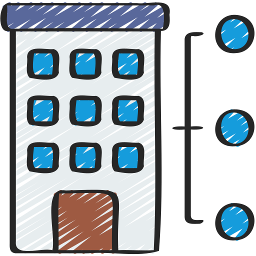
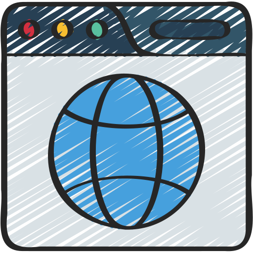
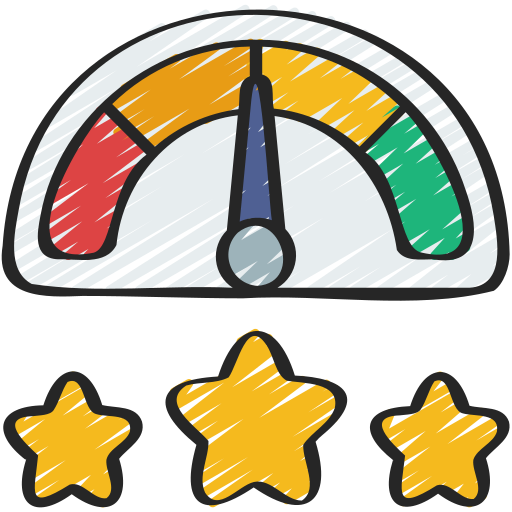

# Microservice architecture and Machine Learning example using Python, Flask, Docker and TensorFlow Keras

##  &nbsp; Stakeholders

Author:

* Lic. Mariano Carreira

Tutors:

* Dra. Claudia Pons 
* Lic. Gabriela Perez
* Dr. Andres Diaz Pace
* Dr. Matias Urbieta

Institution:

* Universidad Nacional de La Plata

##  &nbsp; Summary

This solution was developed within the framework of the "Software Engineering Topics 2" course in the Master's in Software Engineering program at the University of La Plata during the second semester of 2023.  
Successful completion of this project is a prerequisite for passing the course.

##  &nbsp; Requirements

### Machine Learning

On the machine learning side, it was requested to create a ml model to predict Hearth Risks by provided set of parameters, also, it was provided the dataset for this model that can be found [here](src/model_ml/dataset/datos_de_pacientes_5000.csv)

### Functional

The functional requirements were outlined by the professors and are detailed in the section Funtional Requirements down below.  
In essence, the project entails creating a machine learning model capable of predicting cardiac risk based on specific parameters.  
Architecturally, the system is required to be built using a microservices architecture, leveraging the knowledge acquired in the course.

### Non-functional

Although no functional requirements were explicitly provided, an architecture is sought that exhibits responsive performance and demonstrates close scalability. 
Most design and architecture decisions stem from topics covered in class.

### Technologies

For the machine learning model, the proposed technologies included Python, Numpy, Keras, and TensorFlow.  
Python and Flask were recommended for implementing the additional requested services.  
Docker was proposed for deployment.

### Documentation

Comprehensive documentation, encompassing architecture and design decisions, is also a key requirement. 
This work includes the creation of Architectural Decision Records (ADRs), Sequence Diagrams, and Diagrams using Domain-Driven Design (DDD) principles.

##  &nbsp; Solution Implemented

### Functional requeriments

- [TpIntegrador](/documentation/requirements/TP%20Integrador.pdf)

### Non-Functional requeriments

* Scalability.
* Fault Tolerance.
* Interoperability.
* Maintainability.

##  &nbsp; Architecture

Important: The architecture was **overdimensioned** to some extent to comprehensively address the topics covered in class.

### ADRs

The ADR template comes from [here, Copyright (c) 2023 Paulo Merson](https://github.com/pmerson/ADR-template/blob/master/ADR-template.md)

- [ADR00-RestFull-API](/documentation/architecture/ADRs/ADR00-RestFull-API.md)
- [ADR01-Microservicios-Style](/documentation/architecture/ADRs/ADR01-Microservicios-Style.md)
- [ADR02-RabbitMq](/documentation/architecture/ADRs/ADR02-RabbitMq.md)
- [ADR03-Contenerizacion-Docker](/documentation/architecture/ADRs/ADR03-Contenerizacion-Docker.md)
- [ADR04-AppGateway-pattern](/documentation/architecture/ADRs/ADR04-AppGateway-pattern.md)
- [ADR05_Flask_FlaskORM](/documentation/architecture/ADRs/ADR05_Flask_FlaskORM.md)

### Architecture Views

The selected diagram model is **C4 Model**, created by Simon Brown [Linked-In Profile](https://www.linkedin.com/in/simonbrownjersey).  
For more details, please refer to the documentation available [C4Model.com](https://c4model.com/).  

All the diagrams were done using Structuralizer and PlantUml

* Resources
  - [Structurizr](https://structurizr.com/)
  - [Structurizr Documentation](https://docs.structurizr.com/)
  - [Plantuml](https://plantuml.com/)

Note: Components and Code diagram's level, from the C4 Model, were meged into a single document.

#### System's Level

- [V01-C4_System-context-view](/documentation/architecture/views/V01-C4_System-context-view.md)

#### Containers' Level

- [V02-C4_Containers-all-view](./documentation/architecture/views/V02-C4_Containers-all-view.md)
- [V03-C4_Containers-ApiGateway-view](/documentation/architecture/views/V03-C4_Containers-ApiGateway-view.md)
- [V04-C4_Containers-Queue-view](/documentation/architecture/views/V04-C4_Containers-Queue-view.md)
- [V05-C4_Containers-PredictionsMs-view](/documentation/architecture/views/V05-C4_Containers-PredictionsMs-view.md)
- [V06-C4_Containers-UsersMs-view](/documentation/architecture/views/V06-C4_Containers-UsersMs-view.md)

#### Components' and Code's Level

- [V07-C4_Component-ApiGateway-view](/documentation/architecture/views/V07-C4_Component-ApiGateway-view.md)
- [V08-C4_Component-UsersMs-view](/documentation/architecture/views/V08-C4_Component-UsersMs-view.md)
- [V09-C4_Component-LoggingMs-view](/documentation/architecture/views/V09-C4_Component-LoggingMs-view.md)
- [V10-C4_Component-PredictionsMs-view](/documentation/architecture/views/V10-C4_Component-PredictionsMs-view.md)

##   &nbsp; Instructions to run the solution

[Prerequisites](/documentation/tests/Tests_Prerequisites.md)

##   &nbsp; Testing

[Test #01 - Internal User - Add User Account](/documentation/tests/Test_01.md)

[Test #02 - Internal User - List all Users](/documentation/tests/Test_02.md)

[Test #03 - Internal User - Make a prediction](/documentation/tests/Test_03.md)

[Test #04 - External User - Invalid Api-Key](/documentation/tests/Test_04.md)

[Test #05 - External User - Invalid Request](/documentation/tests/Test_05.md)

[Test #06 - External User - Succeded Prediction](/documentation/tests/Test_06.md)

[Test #07 - External User - Rate Limited Exceded (PREMIUM)](/documentation/tests/Test_07.md)

[Test #08 - External User - Rate Limited Exceded (FREMIUM)](/documentation/tests/Test_08.md)

[Test #09 - Internal User - Query Logs generated](/documentation/tests/Test_09.md)

[Test #10 - Internal User - Test Predictor Cache response time](/documentation/tests/Test_10.md)

[Test #11 - Internal User - Delete User](/documentation/tests/Test_11.md)
