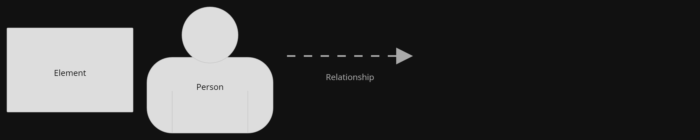

# System Context View

View and diagram based on [C4 Diagram Models](https://c4model.com/).

Provides the overall system context. It represents the system as a box surrounded by the user/actor and other systems that interact with it. It helps to take a step back to see the context.

Intended audience: Tech and non-tech people inside and outside of the team.

## Element Catalog 

#### Element "Sistema de Riesto Cardíaco"
- System for Hearh Risk predictions exposed by an API RestFull
- Expose Internal and External APIs

#### Element "External User"
- Performs API Post Call to query Hearh Risks probabilitie. It does not have access to any internal service.
- Users are vailidated by an Api-Key present in POST call's Headers

#### Element "Internal User"
- Performs API Calls to internal services (API).
- They have access to any internal service, and be able to manage users, query logs and query Hearth Risks.
- Internal users are not vailidated do we expect to query trought an internal VPN.

## Behavior
- N/A
 
## Related ADRs 
- [ADR00-RestFull-API](../ADRs/ADR00-RestFull-API.md)
- [ADR01-Microservicios-Style](../ADRs/ADR01-Microservicios-Style.md)
- [ADR04-AppGateway-pattern](../ADRs/ADR04-AppGateway-pattern.md)

## Related Views
- [V02-C4_Container-view](../views/V02-C4_Container-view.md)