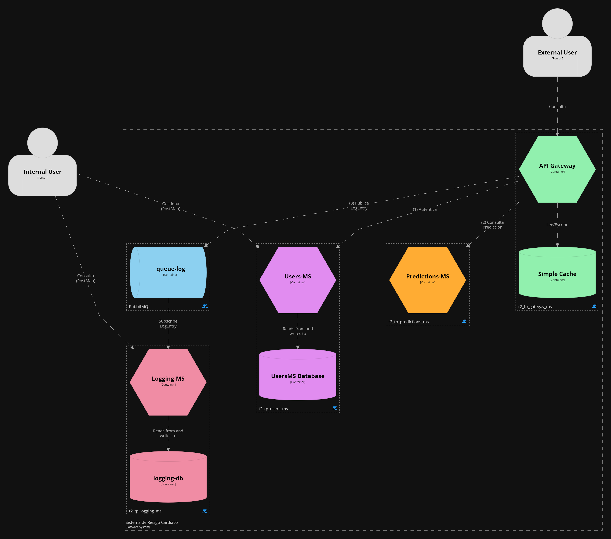

# Containers View - All Containers
View and diagram based on [C4 Diagram Models](https://c4model.com/).

Container diagram represents the individual service or application. The application should be separately runnable or deployable unit. It provides high-level technology focussed diagrams.

Intended audience: Developers, software-architects inside and outside of the team.

## Element Catalog 
(There's no need to list *all* elements in the diagram, just the ones that require further information. Give the 
 information in a bulleted list for improved readability.)

#### Element X
- info
- info

#### Element Y
- info
- info

## Behavior
- if applicable, add one or more behavior diagrams, such as sequence diagrams or state diagrams. They should complement 
the structural diagram shown up-front.
 
## Related ADRs 
- just add the link
- just add the link

## Related Views
- just add the link 
- just add the link