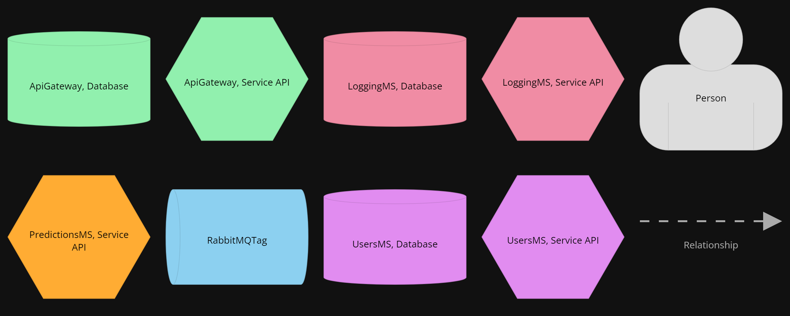

# Containers View - All Containers
View and diagram based on [C4 Diagram Models](https://c4model.com/).

Container diagram represents the individual service or application. The application should be separately runnable or deployable unit. It provides high-level technology focussed diagrams.

Intended audience: Developers, software-architects inside and outside of the team.

## Element Catalog 

#### Api Gateway, Microservice
- Microservice implemented following Api-Gateway pattern.
- Performs Authentication by calling Users-Ms.
- Performs User Rate-limiting by persisting current request count in cache.
- Performs Collect requests tracing informacion and publish as log entries to the queue.

#### Api Gateway, Database
- Cache DB implemented by Simple Cache.
- It persist the number of request per minute, and therefore help rate-limiter to do its job.

#### LoggingMS, Microservice
- Microservice exposing an API Rest.
- Logging-queue (RabbitMQ) subscriber for log entries.
- It persists log entries to its own database.
- No authentication needed to query logs.

#### LoggingMS, Database
- Database (postgress) serving the LoggingMS for logging persisting and quering.

## Behavior

- N/A
 
## Related ADRs 
- [ADR00-RestFull-API](/documentation/architecture/ADRs/ADR00-RestFull-API.md)
- [ADR01-Microservicios-Style](/documentation/architecture/ADRs/ADR01-Microservicios-Style.md)
- [ADR03-Contenerizacion-Docker](/documentation/architecture/ADRs/ADR03-Contenerizacion-Docker.md)
- [ADR04-AppGateway-pattern](/documentation/architecture/ADRs/ADR04-AppGateway-pattern.md.md)
- [ADR02-RabbitMq](/documentation/architecture/ADRs/ADR02-RabbitMq.md)

## Related Views
- [V01-C4_System-context-view](./V01-C4_System-context-view.md)
- [V02-C4_Containers-all-view](./V02-C4_Containers-all-view.md)
- [V03-C4_Containers-ApiGateway-view](./V03-C4_Containers-ApiGateway-view.md)
- [V04-C4_Containers-Queue-view](./V04-C4_Containers-Queue-view.md)
- [V05-C4_Containers-PredictionsMs-view](./V05-C4_Containers-PredictionsMs-view.md)
- [V06-C4_Containers-UsersMs-view](./V06-C4_Containers-UsersMs-view.md)
