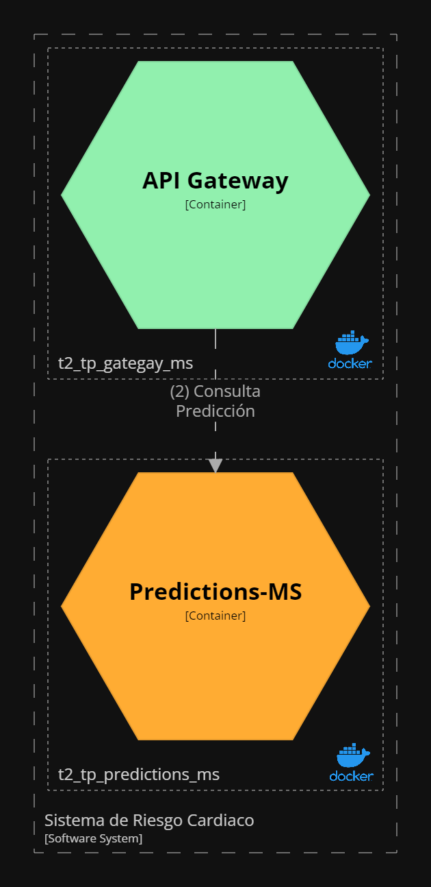
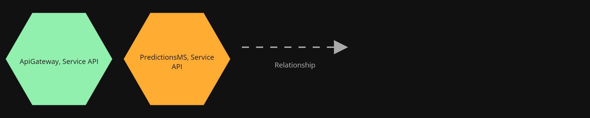

# Containers View - Hearth Risk Predictions Microservice
View and diagram based on [C4 Diagram Models](https://c4model.com/).

Container diagram represents the individual service or application. The application should be separately runnable or deployable unit. It provides high-level technology focussed diagrams.

Intended audience: Developers, software-architects inside and outside of the team.

## Element Catalog 

#### Api Gateway, Microservice
- Microservice implemented following Api-Gateway pattern.
- Performs Authentication by calling Users-Ms.
- Performs User Rate-limiting by persisting current request count in cache.
- Performs Collect requests tracing informacion and publish as log entries to the queue.

#### Api Gateway, Database
- Cache DB implemented by Simple Cache.
- It persist the number of request per minute, and therefore help rate-limiter to do its job.

## Behavior
- N/A
 
## Related ADRs 
- just add the link
- just add the link

## Related Views
- just add the link 
- just add the link