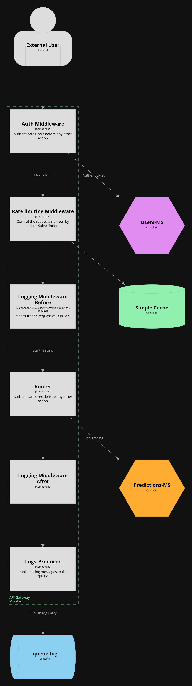
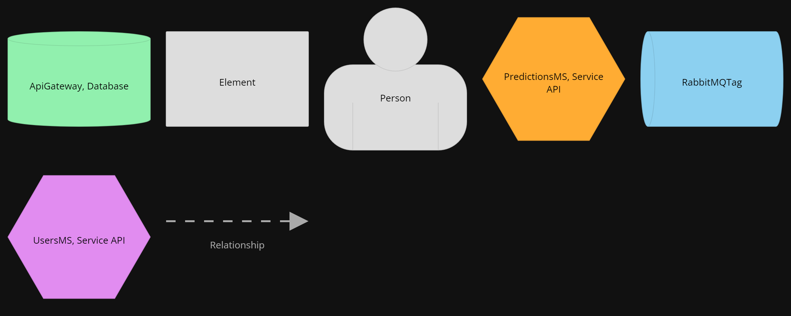

# V07 Component - ApiGateway

View and diagram based on [C4 Diagram Models](https://c4model.com/).

Component diagram shows how a container is made up of a number of components.  
Provides more details about the responsibilities and the technology/implementation details of components.
 

## Element Catalog 

#### External User
- Human being with a valid Api-Key.
- Human being with a valid subscription.

#### Auth Midleware

- Entry point for external users.
- Authenticates users before any other action.
- It calls Users-MS as authentication provider.

#### Rate Limiting Middleware

- Control the request number by user's suscriptions.
- Uses information about subscriptions returned by Auth Middleware.
- Stores number of perfomed requests by users in cache.

#### Logging Middleware Before
- Start collecting request information.
- Start collecting timestamp for the request.

#### Router
- Handles request calls and routes them to internal microservices.

#### Logging Middleware After
- Collect all metrics set by Logging Middleware Before.
- Collect any other specific metric before request.
- Control Exceptions and generate logs for them.
- Creates a Log Entry with metrics or exceptions to the Logging-Queue.

#### Logs Producer
- Connects and manage logging queue connections. (RabbitMQ)
- Publish the Log Entries generated.

## Behavior

- N/A
 
## Related ADRs
- [ADR00-RestFull-API](/documentation/architecture/ADRs/ADR00-RestFull-API.md)
- [ADR01-Microservicios-Style](/documentation/architecture/ADRs/ADR01-Microservicios-Style.md)
- [ADR03-Contenerizacion-Docker](/documentation/architecture/ADRs/ADR03-Contenerizacion-Docker.md)
- [ADR04-AppGateway-pattern](/documentation/architecture/ADRs/ADR04-AppGateway-pattern.md)
- [ADR02-RabbitMq](/documentation/architecture/ADRs/ADR02-RabbitMq.md)

## Related Views
- [V03-C4_Containers-ApiGateway-view](./V03-C4_Containers-ApiGateway-view.md)
- [V04-C4_Containers-Queue-view](./V04-C4_Containers-Queue-view.md)
- [V06-C4_Containers-UsersMs-view](./V06-C4_Containers-UsersMs-view.md)
- [V08-C4_Component-UsersMs-view](./V08-C4_Component-UsersMs-view.md)
- [V10-C4_Component-PredictionsMs-view](./V10-C4_Component-PredictionsMs-view.md)
