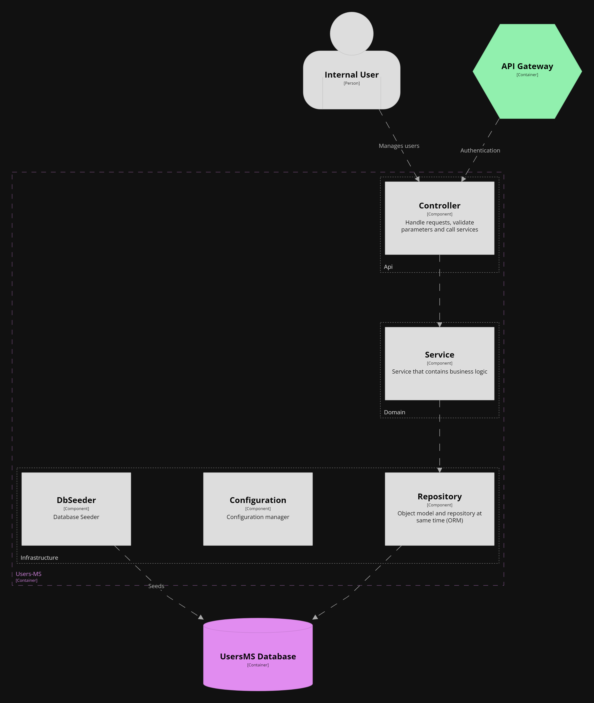

# V08 Component - Users Microservice
View and diagram based on [C4 Diagram Models](https://c4model.com/).

Component diagram shows how a container is made up of a number of components.  
Provides more details about the responsibilities and the technology/implementation details of components.
 

## Element Catalog 

#### Internal User
- Human being with a access to the VPN.

#### Api Gateway
- Microservice that routes the call to this service.
- Entry point for External users.

#### Controller
- Handles requests.
- Validates requests parameters.

#### Service
- Contains business logic.
- Business logic entry point.
- Acces to the Repository

#### Repository
- Access to the database. (read/write)
- Contains also the model objects.

#### Configuration
- Handles configuration.
- Configuration source depends on the environment its running.

#### Db Seeder
- Creates (if they are not) tables needed for the ORM.
 
## Related ADRs 
- [ADR00-RestFull-API](/documentation/architecture/ADRs/ADR00-RestFull-API.md)
- [ADR01-Microservicios-Style](/documentation/architecture/ADRs/ADR01-Microservicios-Style.md)
- [ADR03-Contenerizacion-Docker](/documentation/architecture/ADRs/ADR03-Contenerizacion-Docker.md)
- [ADR04-AppGateway-pattern](/documentation/architecture/ADRs/ADR04-AppGateway-pattern.md)
- [ADR05_Flask_FlaskORM](/documentation/architecture/ADRs/ADR05_Flask_FlaskORM.md)

## Related Views
- [V06-C4_Containers-UsersMs-view](./V06-C4_Containers-UsersMs-view.md)
- [V03-C4_Containers-ApiGateway-view](./V03-C4_Containers-ApiGateway-view.md)
- [V07-C4_Component-ApiGateway-view](./V07-C4_Component-ApiGateway-view.md)