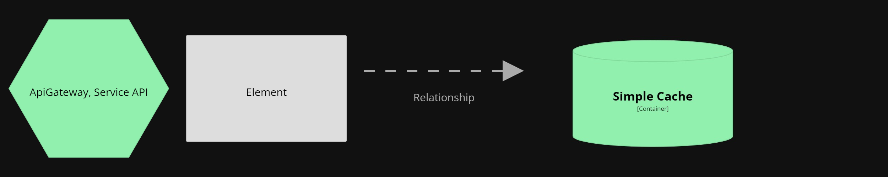

# V10 Component - Predictions Microservice
View and diagram based on [C4 Diagram Models](https://c4model.com/).

Component diagram shows how a container is made up of a number of components.  
Provides more details about the responsibilities and the technology/implementation details of components.
 

## Element Catalog 

#### Api Gateway
- Microservice that routes the call to this service.
- Entry point for External users.

#### Controller
- Handles requests.
- Validates requests parameters.

#### Simple Cache
- Caches predictions.

#### Service
- Contains business logic.
- Business logic entry point.
- Acces to Machine Learning Model

#### Riesgo_cardiaco_model_v1
- Machine Learning model to predict Hearth Risks.

#### Configuration
- Handles configuration.
- Configuration source depends on the environment its running.

## Behavior (C4 Code Level)
   - Query predictions flow

 

## Related ADRs 
- [ADR00-RestFull-API](/documentation/architecture/ADRs/ADR00-RestFull-API.md)
- [ADR01-Microservicios-Style](/documentation/architecture/ADRs/ADR01-Microservicios-Style.md)
- [ADR03-Contenerizacion-Docker](/documentation/architecture/ADRs/ADR03-Contenerizacion-Docker.md)
- [ADR04-AppGateway-pattern](/documentation/architecture/ADRs/ADR04-AppGateway-pattern.md)
- [ADR05_Flask_FlaskORM](/documentation/architecture/ADRs/ADR05_Flask_FlaskORM.md)

## Related Views
- [V09-C4_Component-LoggingMs-view](./V05-C4_Containers-PredictionsMs-view.md)