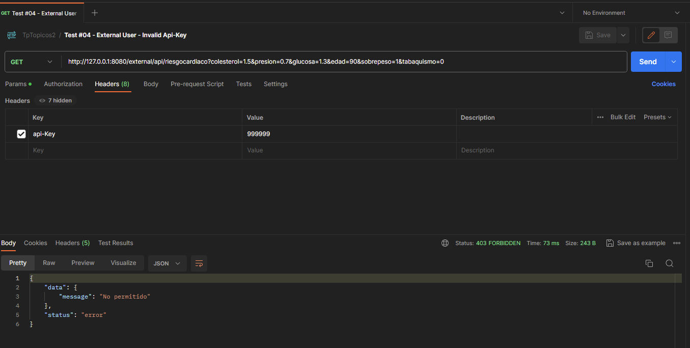

### Test #04 - External User - Invalid Api-Key

**Description:**

This test Internal user to query predictions, but failed because Invalid Api-Key header.

**Purpose:**

- Test invalid api-key against Auth Microservice
- Test App Gateway

**Steps:**

