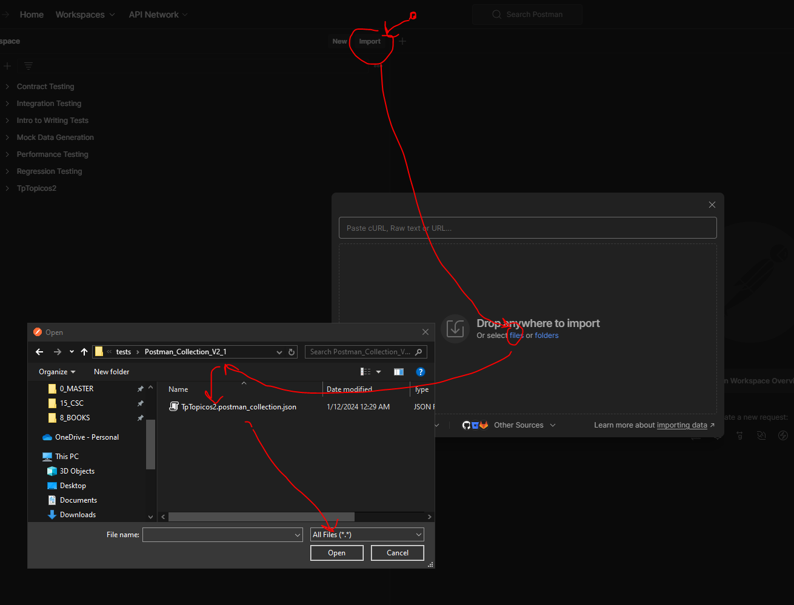
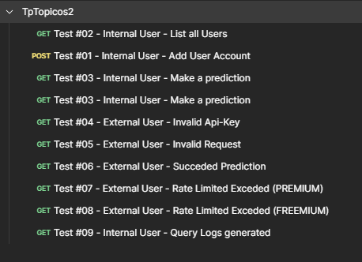

## Pre-requisites

1) Install Postman Client: <br>
[Instructions (Windows and Linux)](https://learning.postman.com/docs/getting-started/installation/installation-and-updates/)
2) Install Docker Desktop: <br>
[Linux](https://docs.docker.com/desktop/install/linux-install/)
[Windows](https://docs.docker.com/desktop/install/windows-install/)
3) Clone this repo: <br>
```bash
git clone https://github.com/marianocarreira/Topicos2_2023.git
```
4) Execute docker compose:
```bash
cd ./infrastructure/
docker compose up --build
```
5) After all the Docker Containers were initilized:

- Open Postman client.

- Open Request collection for testing from:

Be aware about the collection for the version you previously downloaded.

File name: TpTopicos2.postman_collection.json

```bash
cd ./documentation/tests/Postman_Collection_V2_1
ls
```


<br><br>
